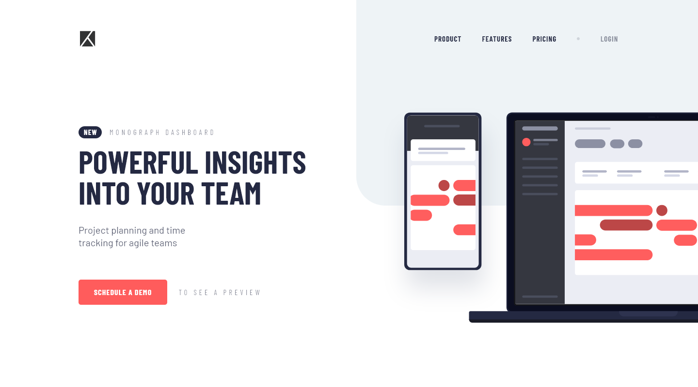

# Frontend Mentor - Project tracking intro component solution

This is a solution to the [Project tracking intro component challenge on Frontend Mentor](https://www.frontendmentor.io/challenges/project-tracking-intro-component-5d289097500fcb331a67d80e). Frontend Mentor challenges help you improve your coding skills by building realistic projects.

### Screenshot

### Links

- Solution URL: [Solution URL here](https://github.com/NDK1195/project-tracking-intro-component)
- Live Site URL: [Live site URL here](https://project-tracking-intro-component-inky.vercel.app/)

### Built with

- HTML5
- Tailwind CSS
- React
